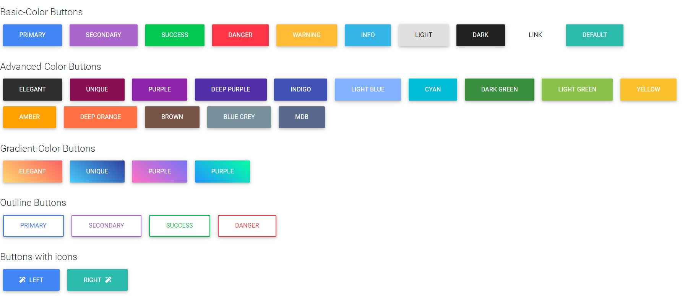

# Bootstrap Integration
This is sample file to refer as to how to integrate bootstrap with our html file and use bootstrap components. The components used in this repo are buttons, cards and spinners. The UI of few components are as given:

### Buttons

### Cards

### Spinner
